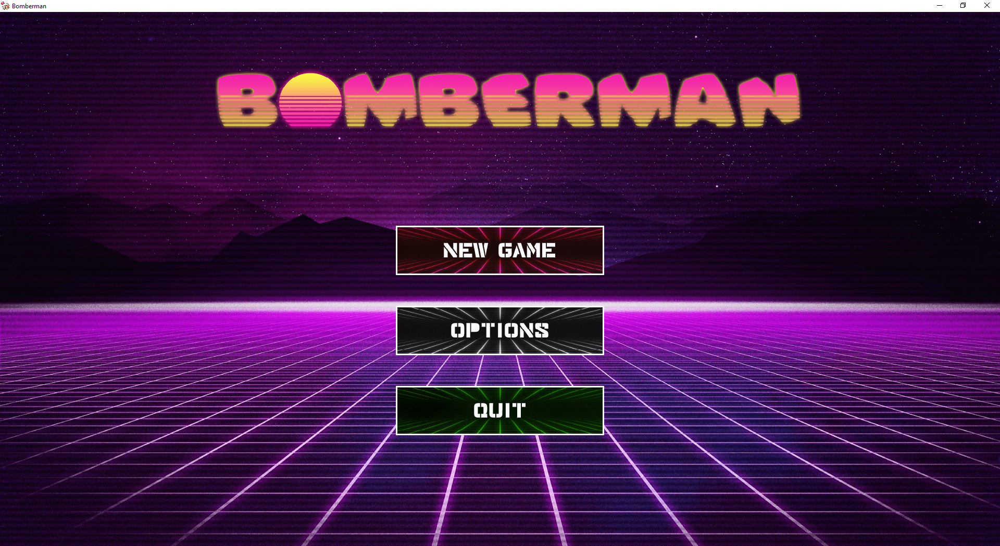
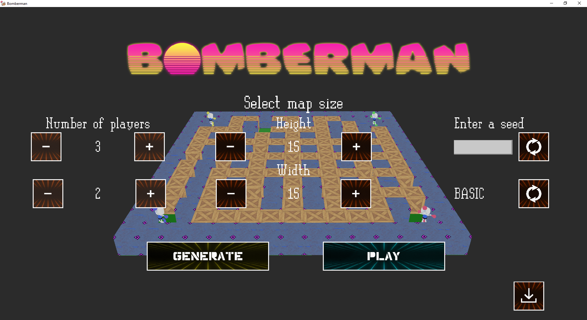
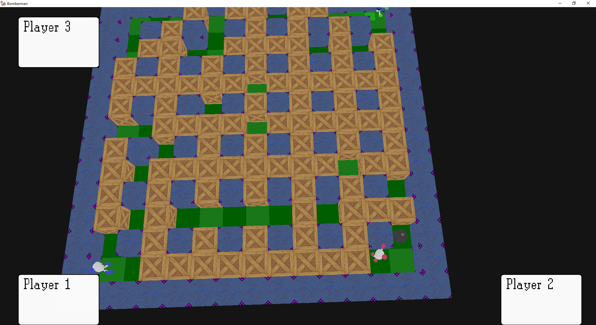

<p align="center"></p>

<p align="center">
<a href="https://github.com/EpitechIT2020/B-YEP-400-NAN-4-1-indiestudio-victor.trencic/actions/workflows/build.yml"></a>
<a href="https://github.com/EpitechIT2020/B-YEP-400-NAN-4-1-indiestudio-victor.trencic/actions/workflows/buildwin.yml"></a>
<a href="https://github.com/EpitechIT2020/B-YEP-400-NAN-4-1-indiestudio-victor.trencic/actions/workflows/test.yml"></a>
</p>

Bomberman is a project where we try to do an Bomberman-like game with a homemade ECS and a Raylib encapsulation

***

## Screenshots

<p align="center"></p>
<p align="center"></p>
<p align="center"></p>

***

## Players Keys

Player 1 will use zqsd to move & E to drop a bomb

Player 2 will use arrows to move & enter to drop a bomb

Player 3 will use yghj to move & space to drop a bomb

***

## Installation

You can build the project yourself!

> Requirements
 - Lua
 - Boost
 - *(Criterion built from its master branch if you want to compile unit tests)*

Clone the repository 
```bash
git clone https://github.com/EpitechIT2020/B-YEP-400-NAN-4-1-indiestudio-victor.trencic.git
```

Go inside the repository and create a build folder
```bash 
mkdir build
cd build
```

Generate using CMake
```bash
cmake ..
```

Compile according to your platform
> Linux
```bash
make -j bomberman
```
> Windows
```powershell
cmake --build . --target bomberman --config release
```

If you've done nothing wrong, you should have the program compiled!
